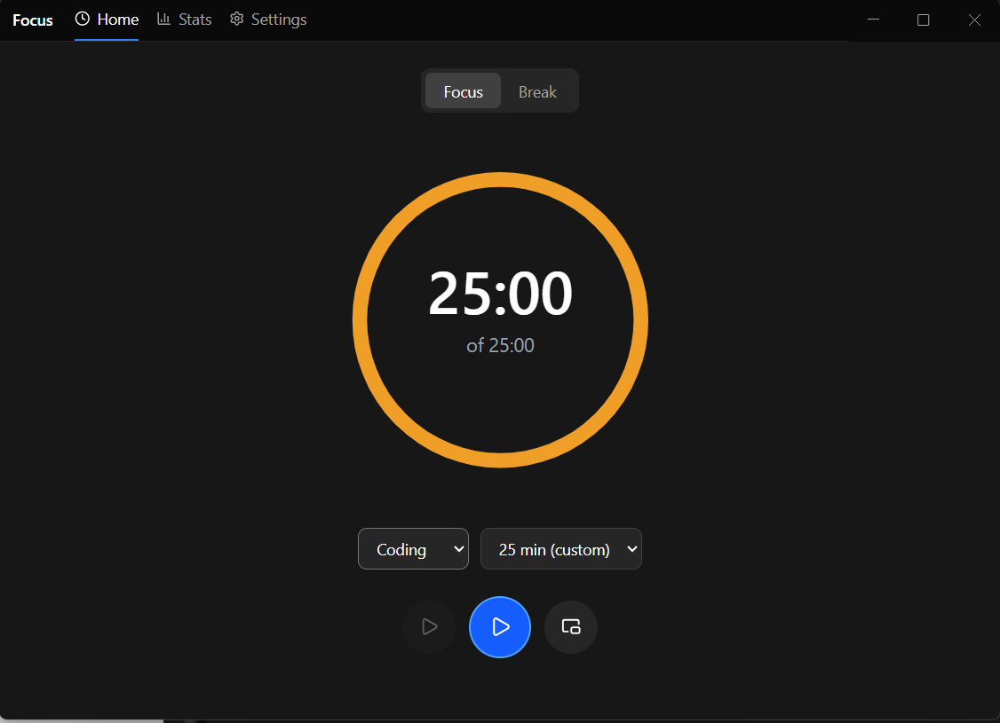
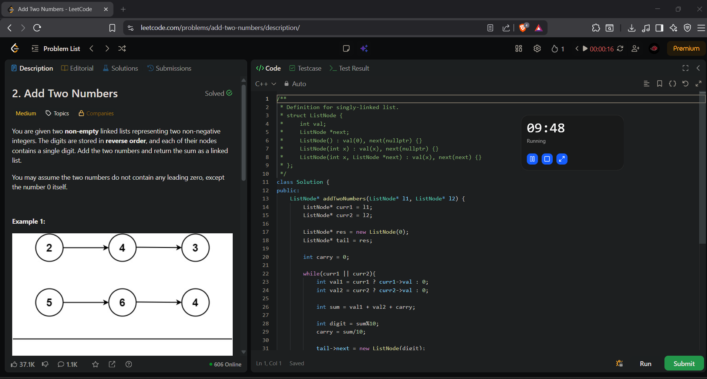
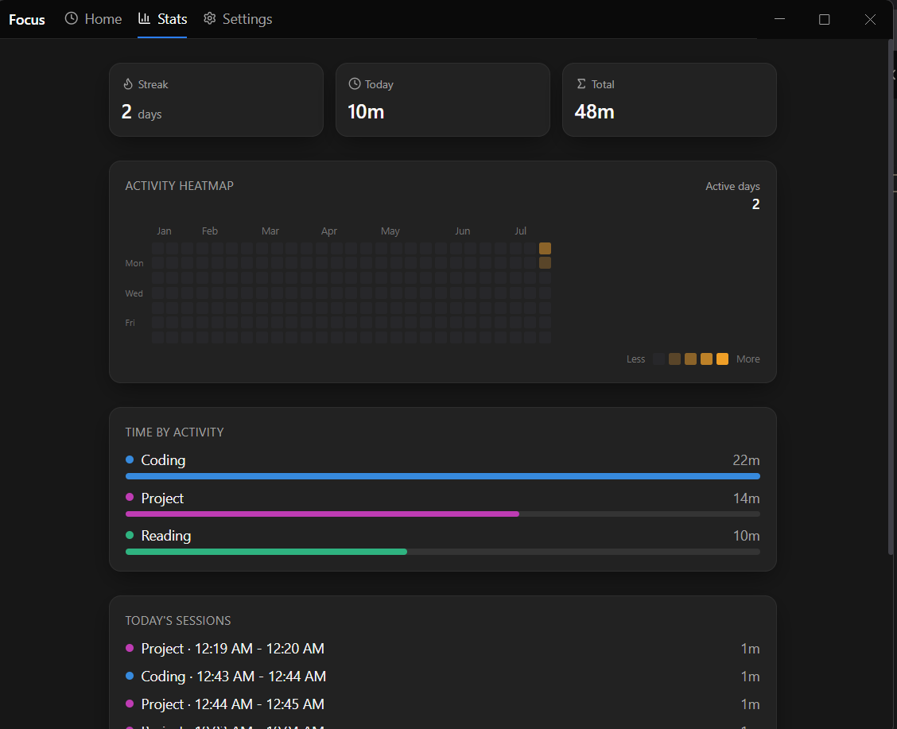
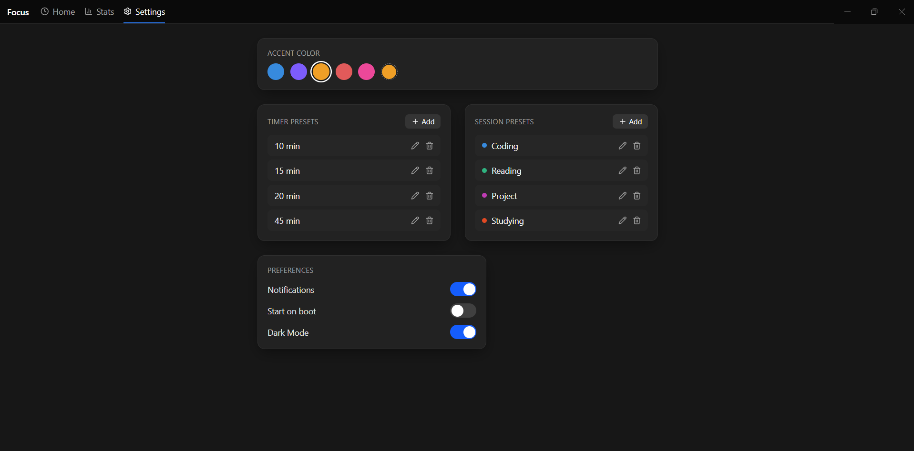

# 🎯 Focus

**A minimal, native-feeling focus timer for Windows — built to help you start working and stay focused without getting in your way.**

<p align="center">
  
  
</p>

<p align="center">
  
  
</p>

---

Focus is a desktop focus timer built for people who do most of their productive work on their computer.

Start a session, choose what you're working on, and get to work. A small draggable overlay keeps your remaining time visible without forcing you to keep the main app open.

Your completed sessions are automatically tracked, giving you a simple way to see where your time goes and how consistently you're showing up.

> **Pick a task. Start the timer. Get to work.**

---

## ✨ Features

### ⏱️ Focus Timer

- Circular countdown timer with visual progress
- Customizable timer duration presets
- Pause, resume, and stop active sessions
- Focus and break modes
- System notification when a session is completed

### 🖥️ Mini Overlay

- Small draggable timer that stays above your other windows
- Keep track of your remaining focus time while coding, studying, or working
- Toggle the overlay without interrupting your active session
- Continues running even when the main Focus window is hidden

### 🏷️ Session Types

Create custom session categories to understand where your time is going.

Examples:

- 🔵 Coding
- 🟠 Studying
- 🟢 Reading
- 🔴 Projects

Session presets can be created, edited, and deleted from Settings.

### 📊 Focus Statistics

Track your productivity over time with:

- Total focus time
- Today's focus time
- Total completed sessions
- Activity heatmap
- Focus time by activity
- Daily session history

### 🔥 Activity Heatmap

A GitHub-inspired activity heatmap helps visualize your focus consistency over time.

The more time you spend focused, the stronger the activity intensity for that day.

### 🎨 Personalization

- Choose your preferred accent color
- Customize timer duration presets
- Create and manage session presets
- Each session type can have its own color

### 📌 System Tray

Closing the main window doesn't quit Focus.

The app continues running quietly in the Windows system tray, allowing active timers and the mini overlay to keep working.

You can reopen Focus directly from the tray whenever you need it.

---

## 📸 Screenshots

<!-- Replace these paths with your actual screenshots -->

### Home


### Focus Session & Mini Overlay


### Statistics


### Settings


---

## 🛠️ Built With

- **Electron** — Desktop application runtime
- **React** — User interface
- **TypeScript** — Type-safe application code
- **Vite** — Development and build tooling
- **Tailwind CSS** — Styling
- **SQLite / better-sqlite3** — Local session and settings storage
- **Zustand** — State management
- **Framer Motion** — UI animations
- **Lucide React** — Icons
- **electron-builder** — Windows application packaging

All focus data is stored locally on your computer using SQLite.

---

## 🚀 Getting Started

### Prerequisites

Make sure you have installed:

- Node.js
- npm

### Clone the repository

```bash
git clone https://github.com/adipanicker/Focus-App
cd Focus-App
```

### Install dependencies

```bash
npm install
```

### Start in development mode

```bash
npm run dev
```

---

## 📦 Building for Windows

Create a production build and Windows installer:

```bash
npm run build
```

The generated installer can be found in:

```text
release/
```

Look for:

```text
Focus Setup 1.0.0.exe
```

---

## 💾 Data Storage

Focus uses a local SQLite database to store:

- Completed focus sessions
- Session types
- Timer presets
- User preferences

No account or internet connection is required to use the core application.

---

## 📥 Download

Pre-built Windows installers are available from the **Releases** section of this repository.

> **Note:** Focus is currently available for Windows only.

Since the application is currently not code-signed, Windows may display an **Unknown Publisher** warning when installing the app.

---

## 🗺️ Future Ideas

Some features that may be explored in future versions:

- Weekly and monthly focus insights
- Daily focus goals
- Focus streaks
- More advanced productivity statistics
- Improved activity heatmap
- Auto updates
- macOS support

---

## 👨‍💻 Author

Built by **Aditya Panicker**.

Focus started as a personal project to build a timer that stays out of the way while still making focused work measurable.

---

## 📄 License

This project is licensed under the ISC License.
